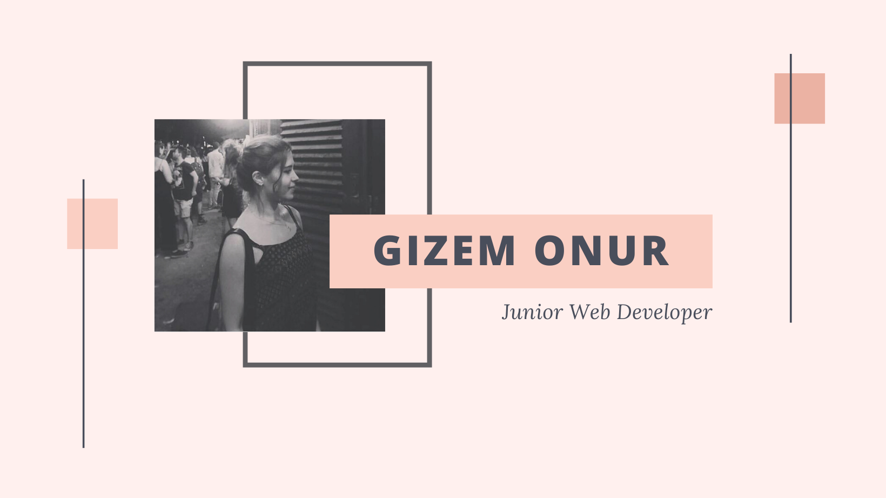

# **Hi ! I'm Gizem !** 👋 👩🏻‍💻

### I'm Gizem, i'm a 25 years old creative and ambitious  Web Developer student at *BeCode* in Brussels.  
 

## **My skills**
- **Good communication skills**

I can follow instructions and ask questions when I need to. I'm also confident in front of an audience.

- **Proactivity**

I make things happen, instead of waiting for them to happen and I usually try to take on different roles.  

- **Creativity**

I like to daydream and imagine the possibilities and wonders of the world. I can immerse myself in imagination yet remain grounded enough to turn my daydreams into reality.

 

 ## **What i like the most in this universe**

 - Food 🍔
 - Art et Design 🎨
 - Animals 🐻

 

## **My objectives as a developer during Becode**

My objectives are to learn the maximum i can about Web Development and Web Design and be able to work in a company that i like to have the opportunity to express myself creatively on the internet. 

 

## **My fears**
I'm afraid of feeling overwhelmed sometimes.

 

## **The things I look forward to**.

- Learning more about Front end
- Team working
 

## **Three things you value the most to work as a team**

- Communication
- Collaboration
- Listening

 

 
